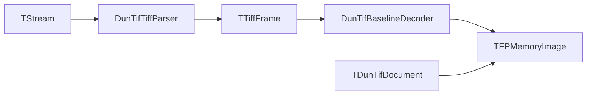

# Архитектура на DunTif

Този документ описва как е организиран пакетът DunTif и как минава потокът от данни при Milestone 1 (четене).

## Карта на модулите

| Unit | Отговорност |
|------|-------------|
| `DunTif.Model` | `TDunTifDocument` притежава `TFPMemoryImage` и `TDunTifMetadata`. Дефинира `EDunTifError`. |
| `DunTif.BinReader` | Ниско ниво четене от поток с endian и проверки на граници. Вдига `EDunTifParseError`. |
| `DunTif.TiffTypes` | Общи enums/records (`TTiffFrame`, compression/photometric и др.). |
| `DunTif.TiffParser` | Парсва TIFF header + първи IFD към `TTiffFrame` и валидира ограниченията за Milestone 1. |
| `DunTif.DecodeBaseline` | Декодира некомпресирани strip данни към пиксели в `TFPMemoryImage` (RGB или grayscale). |
| `DunTif.ModelReader` | Оркестрира parse + decode; попълва `TDunTifDocument.Metadata`. |
| `DunTif.ModelWriter` | Запис чрез `TFPWriterTiff` (fcl-image). |

## Път при четене (Milestone 1)

Подробности:

1. `TDunTifModelReader.LoadFromStream` извиква `TDunTifTiffParser.ParseSingleFrame`, който парсва TIFF от началото на потока (вътрешно през `TDunTifBinReader`).
2. `TDunTifBaselineDecoder.DecodeToFPImage` позиционира се на всеки strip offset и чете „суровите“ некомпресирани байтове ред по ред в `TFPMemoryImage.Colors[x,y]` като `TFPColor`.

## Път при запис (текущ)

`TDunTifModelWriter` сериализира `TFPMemoryImage` към TIFF чрез fcl-image `TFPWriterTiff`. Това е независимо от pure Pascal четенето.

## Изключения

- `EDunTifError` — общи грешки от reader/writer.
- `EDunTifParseError` — грешки при парсване/безопасност на четене (`DunTif.BinReader`, `DunTif.TiffParser`).

## Свързани документи

- [`README.bg.md`](README.bg.md)
- [`TIFF_NOTES.bg.md`](TIFF_NOTES.bg.md)
