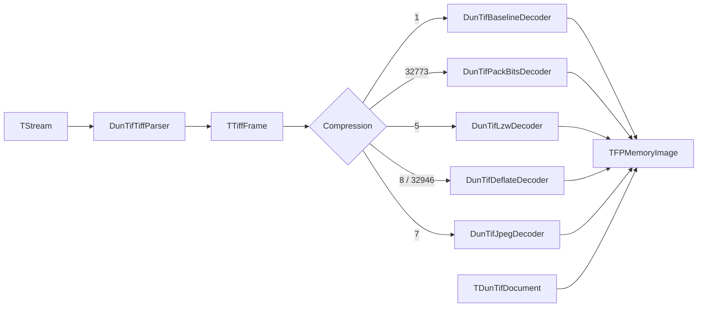

# Архитектура на DunTif

Този документ описва как е организиран пакетът DunTif и как минава потокът от данни при strip четене.

## Карта на модулите

| Unit | Отговорност |
|------|-------------|
| `DunTif.Model` | `TDunTifDocument` притежава `TFPMemoryImage` и `TDunTifMetadata`. Дефинира `EDunTifError`. |
| `DunTif.BinReader` | Ниско ниво четене от поток с endian и проверки на граници. Вдига `EDunTifParseError`. |
| `DunTif.TiffTypes` | Общи enums/records (`TTiffFrame`, compression/photometric и др.). |
| `DunTif.TiffParser` | `ReadFileHeader` + `ParseFrame` (IFD → `TTiffFrame`); `ParseSingleFrame` = първи кадър + валидация. |
| `DunTif.DecodeRaster8` | Записва chunky 8-bit Gray/RGB/RGBA strip проби в `TFPMemoryImage` (общо за декодерите). |
| `DunTif.DecodePredictor` | Обратно horizontal predictor (таг **317 = 2**) върху суров strip буфер при нужда. |
| `DunTif.DecodeBaseline` | Чете некомпресирани strip байтове и подава към `DecodeRaster8`. |
| `DunTif.DecodePackBits` | Разкомпресира PackBits strips и подава към `DecodeRaster8`. |
| `DunTif.TiffLzw` | TIFF LZW битов поток → сурови байтове. |
| `DunTif.DecodeLzw` | LZW на strip + predictor + `DecodeRaster8`. |
| `DunTif.DecodeDeflate` | zlib inflate на strip (PasZLib) + predictor + `DecodeRaster8`. |
| `DunTif.JpegDecode` | Сглобява JPEG strip поток (JPEGTables + strip) и декодира до RGB8. |
| `DunTif.DecodeJpeg` | JPEG-in-TIFF strips (`7`) + `DecodeRaster8`. |
| `DunTif.ModelReader` | Оркестрира parse + decode; попълва `TDunTifDocument.Metadata`. |
| `DunTif.ModelWriter` | Запис чрез `TFPWriterTiff` (fcl-image). |

## Път при четене (компресия)

Подробности:

1. `TDunTifModelReader.LoadFromStream` извиква `TDunTifTiffParser.ParseSingleFrame` (`ReadFileHeader` от offset 0, после `ParseFrame` на първия IFD, после валидация).
2. Според `TTiffFrame.Compression` се избира декодер; всички записват чрез `TDunTifRaster8.WriteChunkyStrip`. При `Predictor = 2` се прилага `DecodePredictor` след декомпресия на всеки strip (не при JPEG).
3. При JPEG (`7`) strip байтовете се слепват с таг **347** `JPEGTables` (без завършващ `FF D9` от таблиците) и се подават на `TFPReaderJPEG`; изходът е RGB8.

## Път при запис (текущ)

`TDunTifModelWriter` сериализира `TFPMemoryImage` чрез fcl-image `TFPWriterTiff`. За `pfGray8`/`pfRGB8` задава `TiffAlphaBits=0` (round-trip с четеца); за `pfRGBA8` записва 8-bit alpha.

## Изключения

- `EDunTifError` — общи грешки от reader/writer.
- `EDunTifParseError` — грешки при парсване/безопасност на четене (`DunTif.BinReader`, `DunTif.TiffParser`).

## Свързани документи

- [`README.bg.md`](README.bg.md)
- [`TIFF_NOTES.bg.md`](TIFF_NOTES.bg.md)
