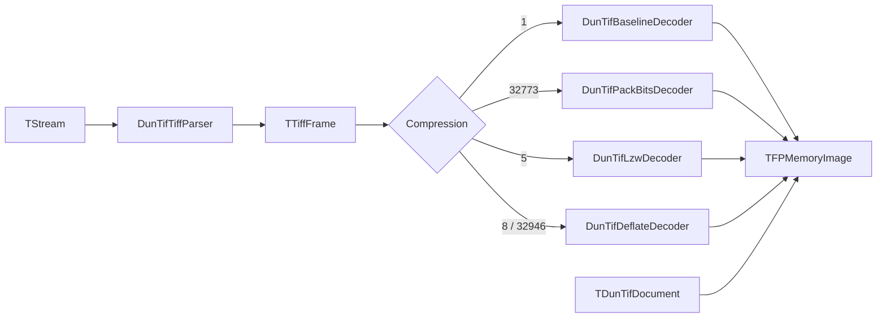

# DunTif architecture

This document describes how the DunTif package is structured today and how data flows through the strip reader path.

## Module map

| Unit | Responsibility |
|------|------------------|
| `DunTif.Model` | `TDunTifDocument` owns a `TFPMemoryImage` plus `TDunTifMetadata`. Defines `EDunTifError`. |
| `DunTif.BinReader` | Low-level stream reads with endian selection and bounds checks. Raises `EDunTifParseError`. |
| `DunTif.TiffTypes` | Shared enums/records (`TTiffFrame`, compression/photometric enums, etc.). |
| `DunTif.TiffParser` | Parses TIFF header + first IFD into `TTiffFrame` and validates reader constraints. |
| `DunTif.DecodeRaster8` | Writes decoded chunky 8-bit strip samples into `TFPMemoryImage` (shared by decoders). |
| `DunTif.DecodePredictor` | Undoes horizontal predictor (tag **317 = 2**) on raw strip bytes when needed. |
| `DunTif.DecodeBaseline` | Reads uncompressed strip bytes and feeds `DecodeRaster8`. |
| `DunTif.DecodePackBits` | Decompresses PackBits strips then feeds `DecodeRaster8`. |
| `DunTif.TiffLzw` | TIFF LZW bitstream → raw bytes (Welch-style decode). |
| `DunTif.DecodeLzw` | Per-strip LZW + optional predictor + `DecodeRaster8`. |
| `DunTif.DecodeDeflate` | Per-strip zlib inflate (PasZLib) + optional predictor + `DecodeRaster8`. |
| `DunTif.ModelReader` | Orchestrates parse + decode; fills `TDunTifDocument.Metadata`. |
| `DunTif.ModelWriter` | Saves using `TFPWriterTiff` (fcl-image). |

## Read path (compression dispatch)

Details:

1. `TDunTifModelReader.LoadFromStream` calls `TDunTifTiffParser.ParseSingleFrame` which rewinds/parses from position 0 (after seeking internally via `TDunTifBinReader`).
2. Depending on `TTiffFrame.Compression`, one of the decoders fills `TFPMemoryImage` via `TDunTifRaster8.WriteChunkyStrip` (`Colors[x,y]` as `TFPColor`). LZW/Deflate/PackBits/Baseline run predictor undo when `TTiffFrame.Predictor = 2`.

## Write path (current)

`TDunTifModelWriter` uses fcl-image `TFPWriterTiff` to serialize `TFPMemoryImage` to TIFF. This is independent from the pure Pascal reader stack.

## Exceptions

- `EDunTifError`: generic DunTif failures surfaced from `ModelReader`/`ModelWriter`.
- `EDunTifParseError`: parsing/binary safety failures (`DunTif.BinReader`, `DunTif.TiffParser`).

## Related docs

- [`README.md`](README.md)
- [`TIFF_NOTES.md`](TIFF_NOTES.md)
